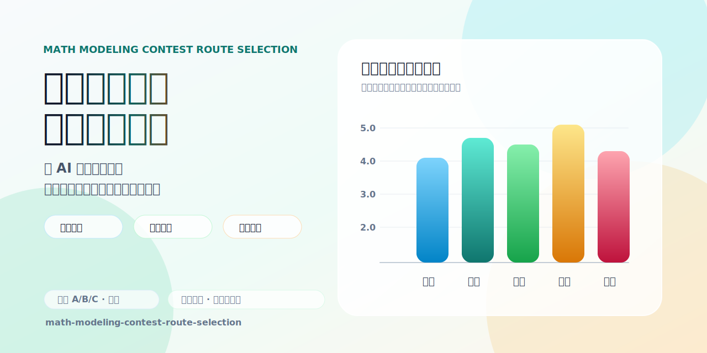

# Math Modeling Contest Route Selection Skill



`math-modeling-contest-route-selection` 是一个面向全国大学生数学建模竞赛、美赛 MCM/ICM 以及同类建模比赛的 Codex/OpenAI Skill。它的目标不是让 AI 机械地给出“选 A/B/C”，而是强制比较每个题目的建模路线、工程可行性、验证方式、反驳条件和论文竞争力。

## 解决什么问题

在数学建模比赛中，AI 很容易给出同质化方案：套 TOPSIS、熵权法、随机森林、LSTM 或泛泛的优化模型，却没有说明为什么这个模型适合题目、怎么验证、什么时候该放弃。这个 skill 用路线选择框架把选题变成可审计的决策过程。

它会帮助参赛者回答：

- 哪个题目不只是“看起来熟悉”，而是真的有更强建模路线？
- 每个小问应该承担什么角色：基线、主模型、扩展、最终建议？
- 为什么选择这个模型，而不是更简单或更流行的模型？
- 数据、参数、求解器、时间和队伍能力是否支撑这条路线？
- 什么证据会推翻当前选择，应该如何 fallback？

## 核心能力

- **A/B/C 选题比较**：先比较题目，再比较每题最强建模路线。
- **逐问建模链设计**：把 Q1/Q2/Q3/Q4 映射为 `first / main / extend / final` 角色。
- **模型选择锦标赛**：要求写出 baseline、被拒绝方案、主模型、决策测试和翻盘条件。
- **工程可行性门控**：检查数据、参数、求解器、代码复杂度、图表产出和 fallback。
- **反 AI 同质化**：惩罚“方法堆叠但无验证”的泛化方案。
- **评分脚本**：用 `scripts/score_topics.py` 生成可复核的 A/B/C 排名报告。
- **国奖论文路线蒸馏**：内置参考文件总结优秀论文常见的问题分解、方法选择和验证逻辑。

## 目录结构

```text
math-modeling-contest-route-selection/
├── SKILL.md
├── agents/
│   └── openai.yaml
├── assets/
│   ├── github-promo-banner.svg
│   └── support-wechat-pay.jpg
├── references/
│   ├── award-method-distillation.md
│   ├── award-question-decomposition.md
│   ├── award-route-pattern-library.md
│   ├── contest-archives.md
│   ├── engineering-feasibility.md
│   ├── method-map.md
│   ├── paper-scoring-framework.md
│   ├── problem-taxonomy.md
│   ├── refutation-and-model-choice.md
│   └── selection-rubric.md
└── scripts/
    └── score_topics.py
```

## 使用方式

将 `math-modeling-contest-route-selection/` 放入支持 Skills 的目录中，然后在 Codex/OpenAI 环境里调用：

```text
Use $math-modeling-contest-route-selection to compare 2025 CUMCM A/B/C and recommend the strongest modeling route.
```

中文调用也可以：

```text
使用 $math-modeling-contest-route-selection 对国赛 A/B/C 题做选题比较，给出主选、备选、每题建模路线、可行性和反驳条件。
```

## 评分脚本

当你已经整理好 A/B/C 的评分 JSON，可以运行：

```bash
python math-modeling-contest-route-selection/scripts/score_topics.py input.json -o report.md
```

脚本会输出：

- 总排名与分差说明
- 题目层评分
- 最强建模路线评分
- 逐问建模链评分
- 缺失字段、同质化风险、fallback 不完整等警告

## 适合谁

- 正在参加国赛、美赛、校赛的建模队伍
- 希望用 AI 辅助选题但不想得到千篇一律方案的队伍
- 需要训练 AI 做建模路线审计、方案反驳和论文竞争力判断的研究者
- 想把优秀论文中的“逐问建模思路”沉淀成可复用流程的人

## 设计原则

1. **路线优先**：选择能完成、能验证、能写成论文的路线，而不是选择听起来高级的题目。
2. **基线先行**：没有 Day 1 baseline 的强模型不可信。
3. **反驳内置**：每个强结论都必须写出什么情况会推翻它。
4. **工程真实**：考虑队伍能力、代码时间、数据清洗和求解器风险。
5. **避免同质化**：高级模型只有在改善可测输出、验证或论文叙事时才有价值。

## 支持与投喂

如果这个 skill 帮你在建模选题、路线比较或论文方案审计里少走了一点弯路，欢迎给主播投喂一个馒头，支持后续继续蒸馏更多数学建模方法、赛题路线和高质量案例。

你的资助会用于维护这个技能包、补充参考材料、优化评分脚本，以及继续打磨“AI 不盲选、方案可反驳、路线能落地”的建模工作流。感谢每一份支持，也欢迎提 issue、交 PR、分享真实使用反馈。

<p align="center">
  
</p>

## License

MIT License. See [LICENSE](LICENSE).
